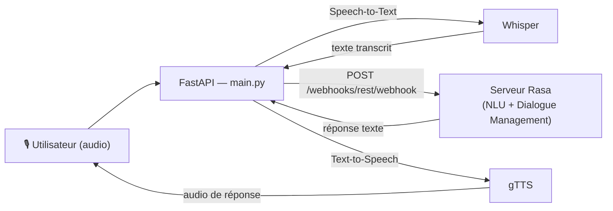

# 🎙️ Voicebot Assurance — Rasa + Whisper + gTTS

Assistant vocal capable de recevoir des déclarations de sinistres (accident
auto, dégât des eaux, vol habitation...), de qualifier la demande et de
guider la conversation en français, à l'oral comme à l'écrit.

## Architecture



| Brique | Rôle |
|---|---|
| **Rasa** (3.6.20, Python 3.10) | Comprend l'intention de l'utilisateur (NLU) et gère le fil de la conversation (Dialogue Management) |
| **Whisper** | Speech-to-Text : transforme la voix reçue en texte |
| **gTTS** | Text-to-Speech : transforme la réponse texte de Rasa en audio |
| **FastAPI** (`main.py`) | Orchestrateur : reçoit l'audio, appelle Whisper puis Rasa puis gTTS, renvoie l'audio de réponse |

Rasa tourne comme **service HTTP indépendant** ; `main.py` lui parle en REST,
exactement comme le ferait n'importe quel autre client. Ce découplage évite
de mélanger, dans un seul environnement Python, les dépendances très
verrouillées de Rasa (numpy, tensorflow, pydantic 1.x) avec celles de
Whisper (torch) — une source fréquente de conflits d'installation.

## Structure du projet

```
voicebot-insurance-rasa/
│
├── data/
│   ├── nlu.yml              # Intentions et exemples de phrases
│   ├── stories.yml          # Exemples de conversations complètes
│   └── rules.yml            # Règles strictes (salutations, etc.)
│
├── config.yml                # Pipeline NLU + politiques de dialogue
├── domain.yml                 # Intents, réponses, slots
├── endpoints.yml               # Config des serveurs Rasa
├── main.py                      # Orchestrateur FastAPI (Whisper + Rasa + gTTS)
├── requirements.txt              # Dépendances du cœur Rasa (venv dédié)
└── requirements-api.txt           # Dépendances de l'API vocale (venv dédié)
```

## Prérequis

- **Python 3.10** (Rasa ne supporte pas Python 3.11 et plus récent)
- **ffmpeg** installé au niveau du système (requis par Whisper) :
  ```bash
  # Ubuntu / Debian
  sudo apt update && sudo apt install ffmpeg
  # macOS
  brew install ffmpeg
  # Windows (avec Chocolatey)
  choco install ffmpeg
  ```

## Installation

Le projet utilise **deux environnements virtuels séparés** pour éviter les
conflits de dépendances entre Rasa et Whisper.

```bash
# 1) Environnement Rasa
python3.10 -m venv venv-rasa
source venv-rasa/bin/activate        # venv-rasa\Scripts\activate sous Windows
pip install -r requirements.txt
deactivate

# 2) Environnement API (FastAPI + Whisper + gTTS)
python3.10 -m venv venv-api
source venv-api/bin/activate
pip install -r requirements-api.txt
deactivate
```

## Lancement

Trois processus à faire tourner (dans trois terminaux, ou en tâche de fond) :

```bash
# Terminal 1 — entraîner puis lancer le serveur Rasa
source venv-rasa/bin/activate
rasa train
rasa run --enable-api --cors "*"
# Rasa écoute sur http://localhost:5005

# Terminal 2 — lancer l'API vocale
source venv-api/bin/activate
uvicorn main:app --reload --port 8000
# L'API écoute sur http://localhost:8000
```

## Tester

**Le plus simple : sans terminal.** Une fois `main.py` lancé, ouvrez
http://localhost:8000/docs dans votre navigateur. Vous verrez une page
interactive (Swagger UI) : cliquez sur `/chat`, puis « Try it out », tapez un
message, et « Execute ». C'est la manière la plus rapide de vérifier que tout
fonctionne, sans taper la moindre commande.

**En ligne de commande, sans audio**, pour vérifier que Rasa répond bien :
```bash
curl -X POST http://localhost:8000/chat \
  -H "Content-Type: application/json" \
  -d '{"sender_id": "test", "message": "je veux déclarer un sinistre"}'
```

**Avec un fichier audio** (`.wav` ou `.mp3`) :
```bash
curl -X POST http://localhost:8000/voice \
  -F "sender_id=test" \
  -F "audio=@mon_message.wav" \
  --output reponse.mp3
```

Documentation interactive de l'API : http://localhost:8000/docs

## Pistes d'amélioration

- Ajouter des **entités** (`sinister_type`, `date`, `lieu`...) et des **slots**
  pour réellement extraire et mémoriser les informations du sinistre déclaré,
  plutôt que de simplement enchaîner des intentions.
- Historiser les déclarations (base de données) plutôt que de se contenter
  d'un message de confirmation.
- Ajouter une petite page web de démo avec enregistrement micro, pratique
  pour une vidéo ou un GIF de présentation LinkedIn.

## Stack technique

Rasa 3.6.20 · Python 3.10 · OpenAI Whisper · gTTS · FastAPI · Uvicorn
